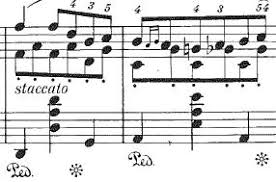

# Scalatudes

I got this idea from [Peter Norvig](https://github.com/norvig). As he explains:
"An *étude* (a French word meaning *study*) is an instrumental musical composition, 
usually short, of considerable difficulty, and designed to provide practice material 
for perfecting a particular musical skill." — [*Wikipedia*](https://en.wikipedia.org/wiki/%C3%89tude)

This project contains **scalatudes**—Scala programs, usually short, for perfecting 
particular programming skills.

# Index of Scala Files

| File                                                                        | Description                                                                                                | Documentation                                            |
|-----------------------------------------------------------------------------|------------------------------------------------------------------------------------------------------------|----------------------------------------------------------|
| [Subsequence.scala](/src/main/scala/etudes/Subsequence.scala)               | *Given two arrays, a function that determines whether the second array is a subsequence of the first one.* | [documentation](/doc/algoexpert/SubSequence.md)          |
| [RiverSizes.scala](/src/main/scala/etudes/RiverSizes.scala)                 | *Given the head of a LinkedList and an integer k, a function that shifts the list in place by k positions* | [documentation](/doc/algoexpert/RiversSize.md) |
| [ShiftingLinkedList.scala](/src/main/scala/etudes/ShiftingLinkedList.scala) | *Given a matrix of 0 and 1, where 1 represents rivers, a function that returns sizes of all rivers*        | [documentation](/doc/algoexpert/ShiftingLinkedList.md)         |
| [RemoveIslands.scala](/src/main/scala/etudes/RemoveIslands.scala)           | *Given a matrix of 0 and 1, remove the blocks of 1 not connected to the borders (called aislands)*         | [documentation](/doc/algoexpert/RiversSize.md)
| [GameOfLife.scala](/src/main/scala/etudes/GameOfLife.scala)                 | *[Conway's Game of Life](https://en.wikipedia.org/wiki/Conway%27s_Game_of_Life)*                           | [documentation](/doc/GameOfLife.md)

# Interesting facts 
